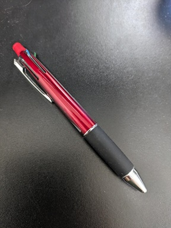

# Image Analyzer featuring Azure OpenAI GPT4 Turbo with Vision

This is the sample application for Image Analisys using Azure OpenAI GPT4 Turbo with Vision model.
This app uploads the target image file to Azure Blob Storage, generate SAS for Azure OpenAI, and call Azure OpenAI GPT4-V to analyze image according to instructions written to the system prompt file.

## Pre-requisites

### .NET 8.0 SDK

Download and Install .NET 8.0 SDK from [here](https://dotnet.microsoft.com/ja-jp/download).

or 

```powershell
#Install by Windows package manager
winget install Microsoft.DotNet.SDK.8 
```

## Azure Service

This sample application needs 2 Azure services as backend:

- Azure Storage Account
    - [Deploy resource using Azure Portal](https://portal.azure.com/#create/Microsoft.StorageAccount-ARM)
    - Create Blob container for temporary storage.
    - Copy the Connection String and the Container Name to `appsettings.json` (or user secrets).
- Azure OpenAI Service and GPT 4 Turbo with Vision model
    - [Deploy resource using Azure Portal](https://portal.azure.com/#create/Microsoft.CognitiveServicesOpenAI)
    - [Deploy model using Azure OpenAI Studio](https://oai.azure.com/portal)
    - Copy the Account endpoint url, the API key, and the Model name to `appsettings.json` (or user secrets).

### User Secret

```powershell
# get secrets id from project file
$secretsid = ([xml](Get-Content ./AoaiImageAnalyzer.csproj)).SelectSingleNode('//UserSecretsId/text()').Value

# secrets.json path in linux/macOS 
$secrets_json = "~/.microsoft/usersecrets/${secretsid}/secrets.json"
# secrets.json path in linux/macOS 
$secrets_json = "${Env:APPDATA}\Microsoft\UserSecrets\${secretsid}\secrets.json"

# open with vscode
code $secrets_json
```

## Running the application

1. Prepare your image file and system prompt in text file.
1. Open soem console like PowerShell.
1. Change directory to the project (./src).
1. Run app with the following command:
1. Result will be generated in the same directory as the image file.

```powershell
dotnet run --prompt-file ./sample-prompt.txt --image-file ./sample-image.png 
```

Generated sample result:



```markdown
- 黒い背景の上に置かれた多色ボールペン
- ペンの本体は赤色で、クリップとノック部分は黒色
- ペンの先端部分は黒いグリップで覆われている
- ペンの上部には緑、赤、黒の3色のノックがある
- ペンのクリップは金属製で光沢がある
- ペンは斜めに置かれており、先端が手前に向いている
```
